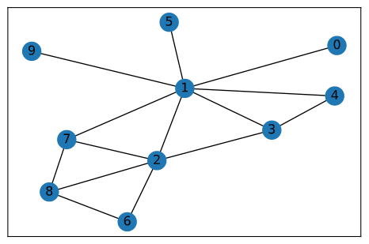

# sina
Social and Information Network Analysis subject - Graph and Network Analytics


## NetworkX
 
[NetworkX Documentation](https://networkx.github.io/documentation/networkx-1.10/tutorial/tutorial.html)

## Clustering coefficient for a vertix

Is the proportion of links between the verticies within its neighbourhood divided by the number of links that could possibly exist between them. 

if k is the number of verticies in the neighbourhood
then number of links (edges) that could possibly exist is k(k-1)/2

```
--> C = number of links in neibhourhood / (k(k-1)/2)
```



``` 
nx.clustering(G)


nx.clustering(G)
{1: 0.14285714285714285,
 2: 0.4,
 3: 0.6666666666666666,
 0: 0,
 4: 1.0,
 5: 0,
 6: 1.0,
 7: 0.6666666666666666,
 8: 0.6666666666666666,
 9: 0}

 ```

 for node 1: 
 
    number of neighbours = 7
    possible links in neighbourhood = 7 * 6 /2 = 21 
    links in neighbourhood = 3 

    => clustering coeeff for node 1 = 3/21 = 0.14286


## bipartite graph with colors

```python
G = nx.Graph()
G.add_nodes_from([1,2,3,4], bipartite=0)
G.add_nodes_from([5,6,7,8], bipartite=1)

G.add_edges_from([(1,5),(1,7),(1,8)])
G.add_edges_from([(2,6),(2,7),(2,8)])
G.add_edges_from([(3,5)])
G.add_edges_from([(4,8),(4,7)])

X, Y = bipartite.sets(G)

pos =dict([(n, (2, i)) for i, n in enumerate(Y)] + [(n, (1, i)) for i, n in enumerate(X)])

color_map = [ "red" if n in X else "blue" for n in G.nodes()]

nx.draw_networkx(G,pos=pos,node_color=color_map)
```
